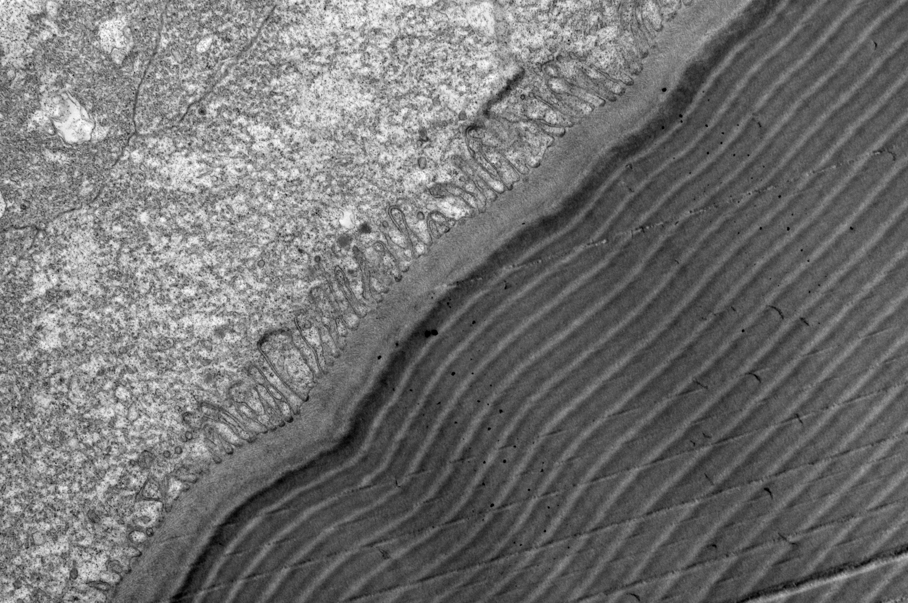
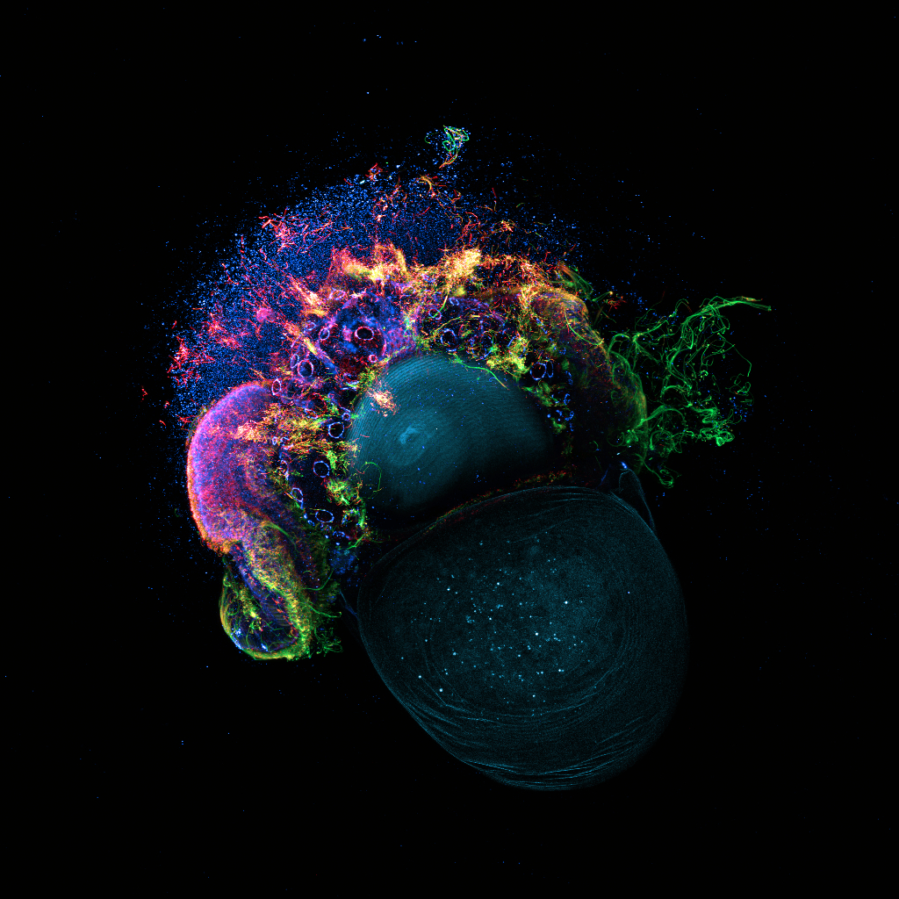
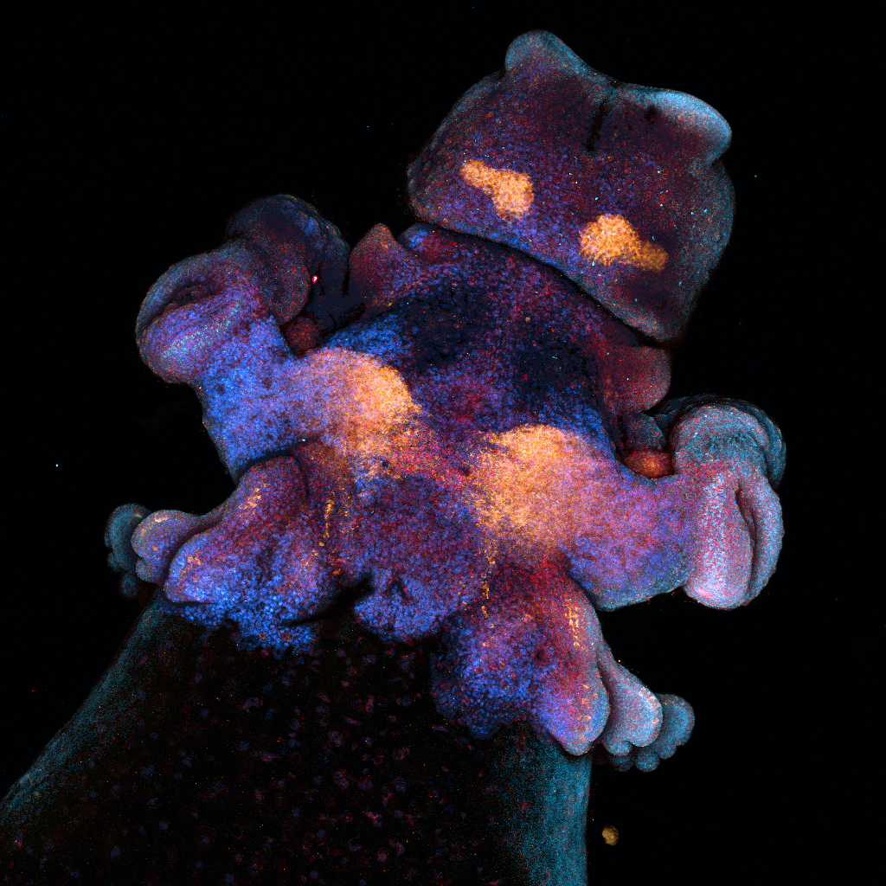
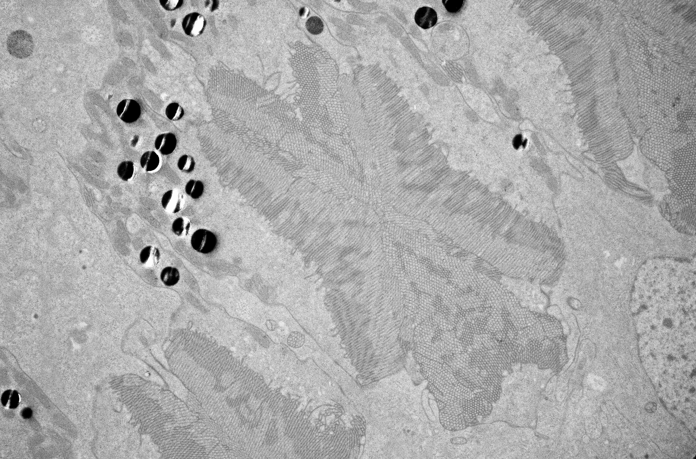
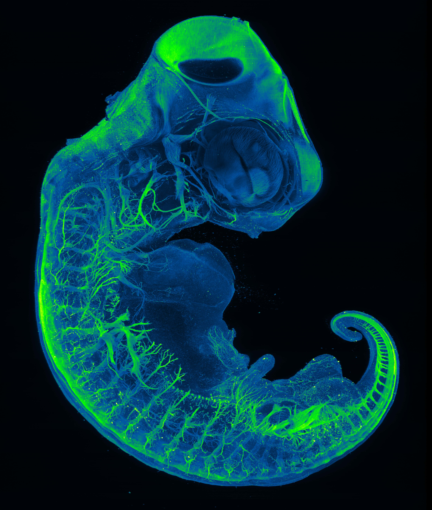
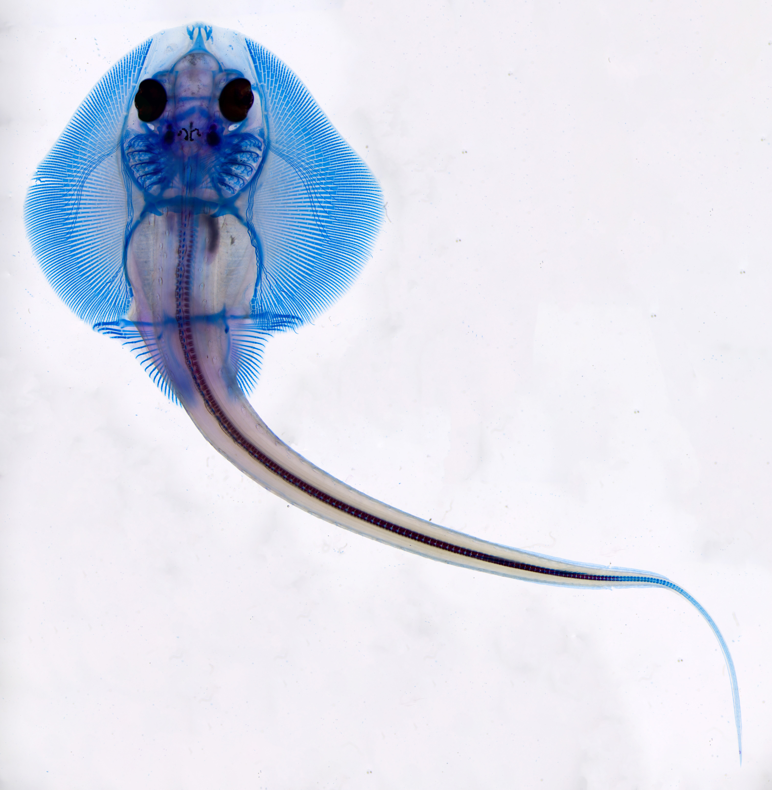
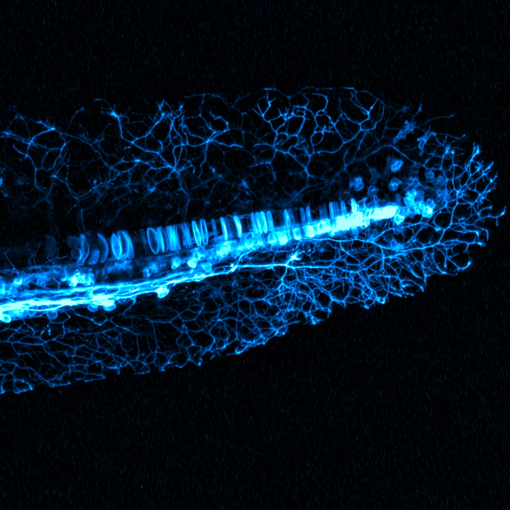
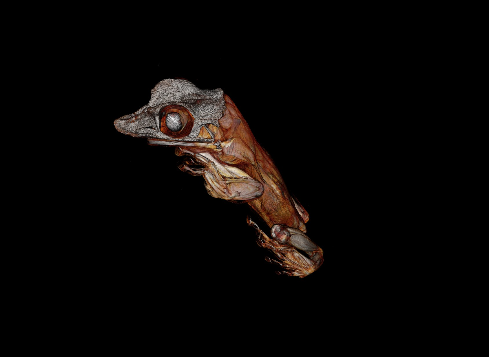

[**Portfolio**](../../portfolio.qmd)

::: masonry-gallery
{group="Microscopy"}

{group="Microscopy"}

{group="Microscopy"}

{group="Microscopy"}

{group="Microscopy"}

{group="Microscopy"}

{group="Microscopy"}

{group="Microscopy"}
:::
