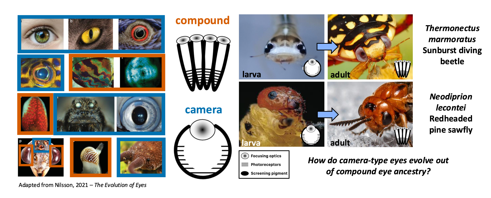
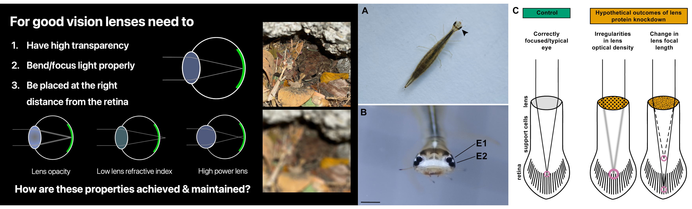
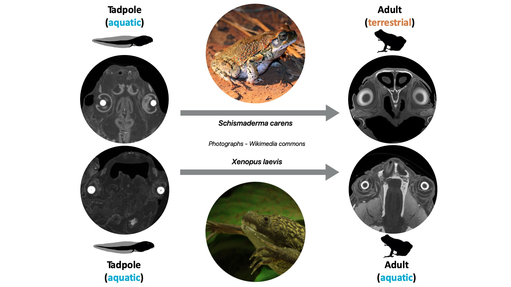

My research revolves around understanding the origins and functions of complex traits. My model system for this has been eyes. Eyes are incredibly diverse in morphology, number and optical organisation. Despite this, there is growing evidence that the many independently evolved eyes across the animal kingdom share a common genetic blueprint. This makes eyes an excellent system to explore how shared genetic underpinnings produce remarkably diverse structures. Because salient eye features such as sensitivity, focus and resolution can be directly measured, it is possible to trace genetic and developmental mechanism to function and behaviour instead of stopping at morphology. This has been the theme of my PhD and masters research.

## Current: PhD in Visual System Development

My dissertation can be broadly divided into two parts. 1) Understanding eye development and evolution, 2) Understanding eye growth and function.

### From compound to camera

Most eyes can be classified as one of two designs: camera-type and compound. Camera-type eyes, like their namesake have a single aperture through which light is focused onto a retina. This is the eye-type that we have and is of quite high resolution. Conversely, compound eyes, like those of flies are composed of multiple repeating units known as ommatidia. Each of these sample discrete portions of the visual field and can be thought of as individual pixels making up the image that the fly sees. While these have a huge field of view, they are of poor resolution compared to camera-type eyes. Despite these differences and trade-offs, both eye types are built using similar and related sets of genes. To understand the mechanism for this, I study arthropods, a group in which camera-type eyes have evolved out of compound eye ancestry. Specifically, my model system are the Holometabola; insects whose larvae have derived camera-type eyes while adults possess compound eyes. In part 1 of my thesis, I explore the development of key retinal cell types in two species which we hypothesise to have evolved camera-type eyes in distinct ways: diving beetles (*Thermonectus marmoratus*) and sawflies (*Neodiprion lecontei*). I have found that larval camera-type eyes derive from a compound eye bauplan through either expansion of single ommatidial units (beetles) or fusion of multiple ommatidial units (sawflies). These findings reveal the modularity and plasticity of arthropod eye-development, indicating how conserved toolkits can generate novel eye organisations.

{width="100%" fig-align="center"}

### How lens proteins achieve transparency

Once developed, functional vision is dependent on the projection of sharp, focused images onto the retina. Vital to this process are lenses, which are crafted using a precise arrangement of proteins for transparency and focusing power and placed at appropriate distance from the retina. In part 2 of my thesis, I genetically manipulated the diving beetle larval lens to remove a vital component during post-embryonic eye development. I found that doing this caused cataracts through protein aggregation, resulting in the projection of degraded and blurry images that impaired their hunting ability in dim, low-light conditions. Notably, cataracts did not change lens focusing power or the *in-vivo* refractive states of larvae. This is in contrast to vertebrates, which develop myopia when viewing blurry images during post-embryonic eye growth. Building on prior work, I showed with this that visual input is not involved in maintaining correctly focused eyes in arthropods, highlighting the utility of this model to study the genetic bases of refractive state development which remain unclear. As a side-project, I was involved in showing that optically coordinated growth is mediated by osmotic processes in the diving beetle larvae.

{width="100%" fig-align="center"}

## Background: Ecology & Evolution

I was first drawn to visual systems during my master's, where I worked on frog lenses. Lens shape and relative size are important determinants of visual acuity (sharpness of images) and sensitivity (the ability to see in low light) respectively. This is why lenses are typically spherical (high power) in aquatic camera-type eyes and flattened in terrestrial eyes (low power) for focused vision in media with different refractive indices. This is why I examined lens shape in frogs which often shift from aquatic to terrestrial ecologies through metamorphosis from tadpole to adult, and also inhabit diverse habitats as adults. By micro-CT scanning numerous frogs of different life stages and ecologies, I found that the lenses of frogs undergo changes in shape through development, starting off spherical in aquatic tadpoles and flattening in terrestrial adults. Notably frogs which remain aquatic as adults, did not undergo this change in lens shape. I also found that burrowing species also retained spherical lenses as adults, possibly due to reduced dependence on their eyes being underground or only relying on vision for breeding behaviours which happen in water. I showed with this work how ecology and development shape visual systems and how non-invasive imaging or museum specimens is a valuable way to examine sensory evolution.

{width="100%" fig-align="center"}

## Future Directions

1.  I anticipate defending my thesis in the spring of 2027.
2.  I am currently looking for posdtoctoral research positions to continue exploring the development and evolution of novel traits.

## Philosophy

I believe in foundational and exploratory research that is curiosity driven. In a climate that increasingly demands that research be justified through predetermined application, I hold that 'basic science' is invaluable, and the primary pathway for transformative and ground-breaking discoveries. PCR, fluorescent proteins, CRISPR and GLP-1 agonist drugs are a few of the countless examples of tools and therapeutics which emerged not from directed research, but from scientists seeking to understand the wonderful and diverse organisms which surround us. That is why I choose to focus my work on novelty - both in unique lineage-specific traits and in new and emerging model organisms which I consider fertile grounds for discovery.
